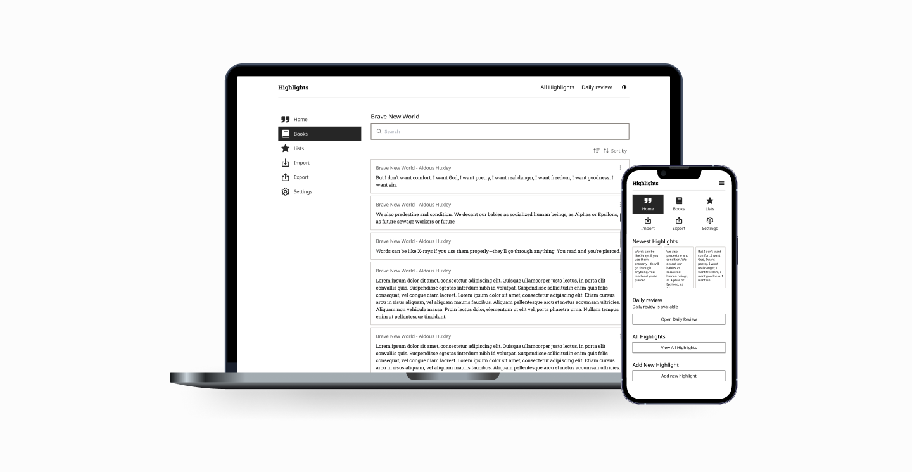

# Onyx Boox Highlight Manager
An easy-to-use app that helps you organize and manage highlights from your Onyx Boox eReader.

## Try it out here
https://booxmanager.netlify.app/

## Features

### 🗄️ Local Storage
- Your highlights are stored locally using **IndexedDB**.
- No need to worry about losing your data; everything is securely stored on your device.

### 📤 Export Highlights
- Easily export your highlights to a file for safekeeping or sharing.
- Perfect for backup or transferring your data to another device.

### 📥 Import Highlights
- Import highlights from a saved DB file back into the app.
- Seamlessly continue where you left off, even on a new device.

### 📅 Daily Review
- Keep your knowledge fresh with a **daily review** of your highlights.
- Never forget important information by revisiting your notes regularly.

### 📋 Highlights Lists
- Organize your highlights into **custom lists** for easy access and management.
- Create, edit, and manage multiple lists to suit your needs.

