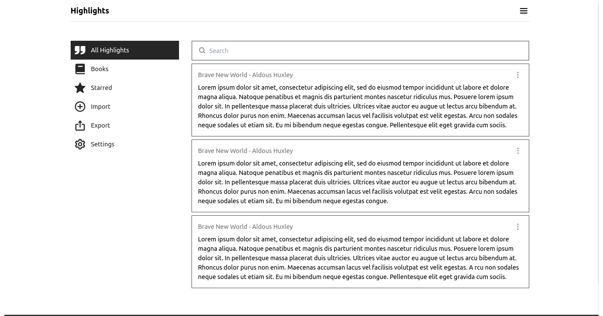

# Onyx boox highlight manager app

This app is currently under development, designed to help you manage and organize highlights from your Onyx Boox device.

## Features
- **Local Storage**: Your highlights are stored locally using IndexedDB.
- **Export Highlights**: Easily export your highlights to a file for safekeeping or sharing.
- **Import Highlights**: Import highlights from a saved db file back into the app.
- **Daily Review**: Keep your knowledge fresh with a daily review of your highlights.
- **Highlights Lists**: Organize your highlights into custom lists for easy access and management.

## Try it out here
https://ehighlights.netlify.app/
